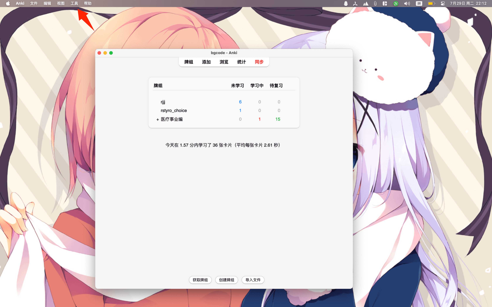
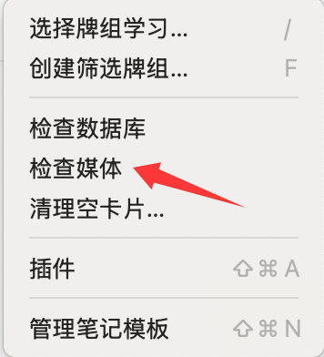
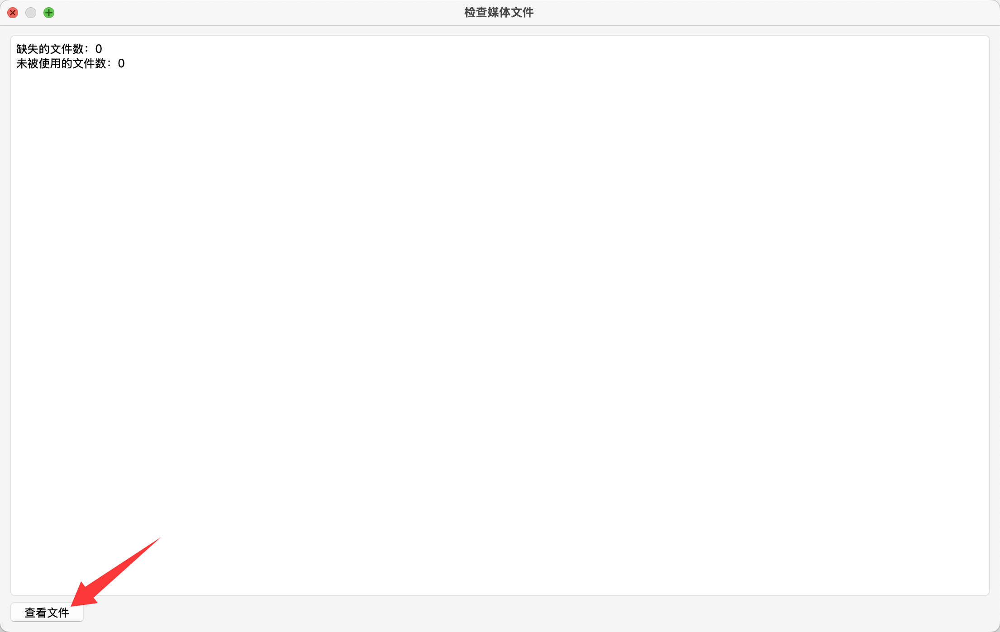
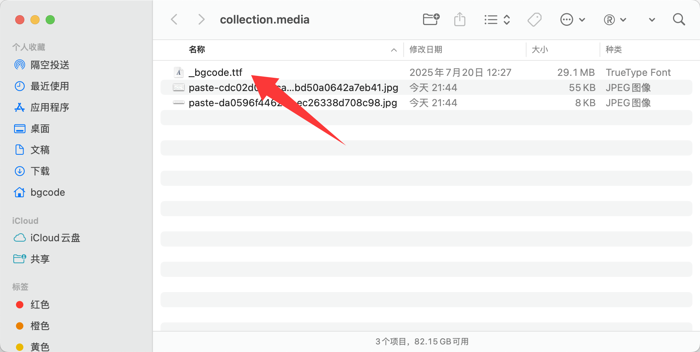
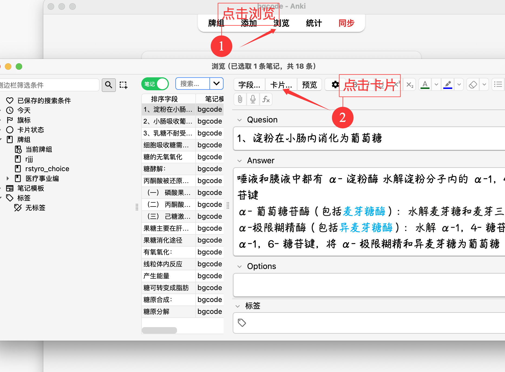
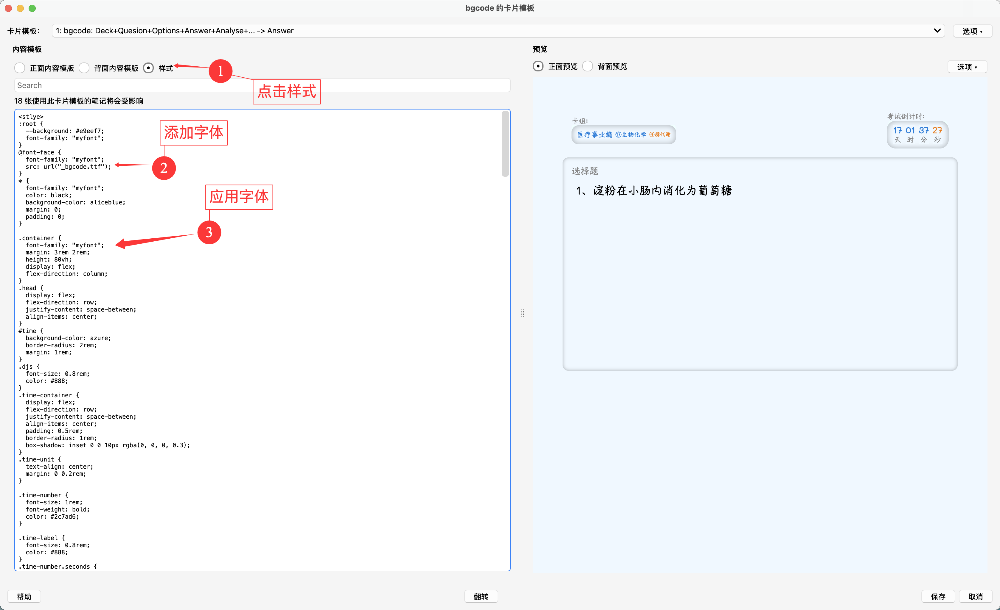

# anki 修改字体同步所有客户端
# mac 下操作方法
#### 1、下载对应字体文件到本地例如：该字体[bgcode](https://ghfast.top/https://raw.githubusercontent.com/bgvioletsky/anki/main/font/bgcode.ttf)
#### 2、添加该文件到媒体库
>1、打开anki软件 
>
>2、点击顶部导航栏工具

>3、点击检查媒体

>
>4、点击查看文件

>
>5、将下载文件放入文件夹并修改文件名为_bgcode.ttf


#### 3、进入卡片修改样式



修改
```css
.card {
    font-family: arial;
    font-size: 20px;
    text-align: center;
    color: black;
    background-color: white;
}
```
为
```css
@font-face {
  font-family: "myfont";
  src: url(_bgcode.ttf)
}
.card {
    font-family: myfont;
    font-size: 20px;
    text-align: center;
    color: black;
    background-color: white;
}
```